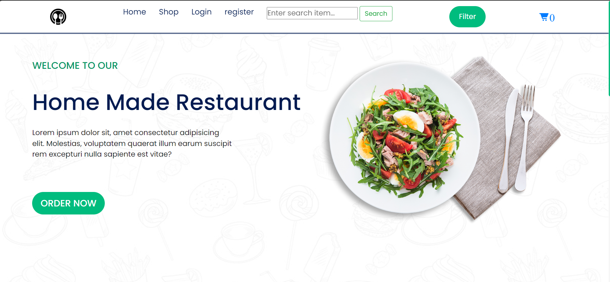
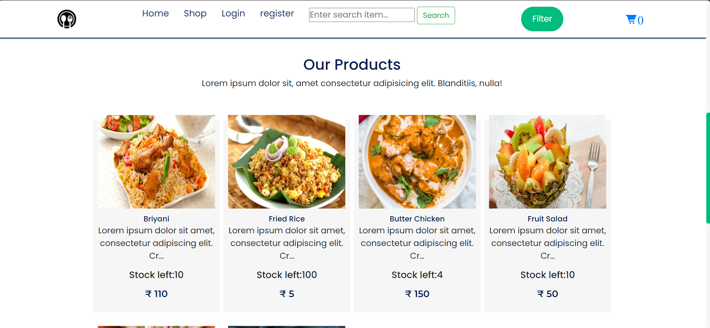

# Restaurant App

Welcome to the **Restaurant App**, a platform where users can browse food items, add them to the cart, and proceed with checkout. Users can register, log in, and filter food items with pagination support.

---

## Features

- **Login & Registration**: Users can create an account or log in to their existing account.
- **Food Selection & Checkout**: Browse and add food items to the cart, and proceed to checkout.
- **Filter Options**: Filter food items based on categories and other criteria.
- **Pagination**: Browse through food items with paginated results.
- **SQLite Database**: Uses SQLite to store user data and food items.

---

## Screenshots

### Hero Page



### Product Page



---

## Installation

Follow the steps below to set up and run the app locally on your machine.

### Prerequisites

Make sure you have the following installed:

- Python 3.x
- pip (Python package manager)
- Virtualenv (recommended)

### Clone the Repository

Clone the repository to your local machine:

```bash
git clone https://github.com/your-username/restaurant-app.git
cd restaurant-app

### Set Up Virtual Environment
python3 -m venv venv
source venv/bin/activate  # On Windows: venv\Scripts\activate

### Install Dependencies
pip install -r requirements.txt

### Database Setup
python manage.py migrate

### Create a Superuser
python manage.py createsuperuser

### Run the App
python manage.py runserver

